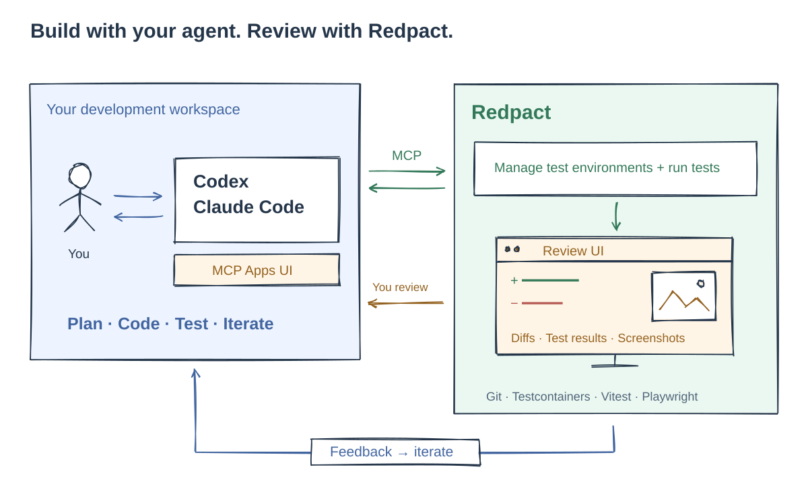

# Redpact

**Review what your coding agent changed—and the evidence behind it.**

Redpact is a local review tool that brings code changes, test intent, execution
results, and application screenshots together in a web or desktop viewer.

[Demo](https://redpact.dev) · [Documentation](https://redpact.dev/en/docs/) · [한국어 문서](https://redpact.dev/ko/docs/)

## How it works



1. **Develop** with Codex or Claude Code in your project checkout.
2. **Run** tests through Redpact in managed test environments.
3. **Review** changes, submitted test intent, results, and captured application states.
4. **Give feedback** to your agent and repeat.

Passing tests do not establish human acceptance. You decide whether the evidence
covers your request. See the [review workflow](docs/review-workflow.md).

<details>
<summary>Diagram source / 다이어그램 원본</summary>

Download the [editable source](.github/assets/how-redpact-works.excalidraw) and open it in [Excalidraw](https://excalidraw.com).
[편집 원본](.github/assets/how-redpact-works.excalidraw)을 내려받아 [Excalidraw](https://excalidraw.com)에서 열 수 있습니다.

</details>

## What you can review

- **Code changes** — Inspect Git diffs across local worktrees.
- **Test intent and source** — Read what the agent submitted to check the requested behavior.
- **Execution results** — Inspect Unit command output, Vitest Integration results, and Playwright evidence.
- **Application screenshots** — See captured application states alongside the changes being reviewed.

## Quick start

Install the CLI and bundled browser viewer on macOS or Linux. This path requires
Node.js 24+, npm, curl, and a SHA-256 utility. Managed tests also require Docker
with Compose.

```sh
curl -fsSL https://raw.githubusercontent.com/wo658/redpact/main/install.sh | sh
export PATH="$HOME/.local/bin:$PATH"
redpact serve --port 54321
```

Open [the local viewer](http://127.0.0.1:54321) and keep the terminal running.
Save the PATH setting in your shell profile for future terminals.

Next, [connect Codex or Claude Code](docs/installation.md#install-an-agent-plugin),
[configure your project](docs/first-project.md), and [run your first test](docs/first-run.md).
For desktop downloads, Homebrew, other installation options, and platform limits,
see the [installation guide](docs/installation.md).

## Documentation

- [Install and connect](docs/installation.md)
- [Set up your first project](docs/first-project.md)
- [Run your first test](docs/first-run.md)
- [Read results](docs/results.md)
- [Explore all guides](https://redpact.dev/en/docs/)

## Contributing and license

Start with [Contributing](CONTRIBUTING.md) and the [development guide](docs/development.md).
See [Governance](GOVERNANCE.md) for project decision-making.

Copyright 2026 Redpact contributors. Licensed under [Apache-2.0](LICENSE), unless
otherwise noted. Preserve third-party licenses and notices. Contributors retain
copyright; no separate CLA is required.

---

<details>
<summary><strong>한국어 — 소개 및 시작하기</strong></summary>

**코딩 에이전트가 무엇을 바꿨는지, 어떤 근거로 확인했는지 검토하세요.**

Redpact는 코드 변경사항, 테스트 의도, 실행 결과와 애플리케이션 스크린샷을
웹 또는 데스크톱 뷰어에서 함께 확인하는 로컬 리뷰 도구입니다.

[데모](https://redpact.dev) · [문서](https://redpact.dev/ko/docs/)

## 동작 방식

상단 다이어그램은 에이전트 개발부터 실행과 리뷰까지의 흐름을 보여줍니다.

1. **개발** — Codex 또는 Claude Code로 프로젝트 체크아웃에서 작업합니다.
2. **실행** — Redpact의 관리형 테스트 환경에서 테스트를 실행합니다.
3. **검토** — 변경사항, 제출된 테스트 의도, 실행 결과와 캡처된 애플리케이션 상태를 확인합니다.
4. **피드백** — 에이전트에게 수정 의견을 전달하고 반복합니다.

테스트 통과가 사람의 승인을 의미하지는 않습니다. 증거가 요청한 내용을 충분히
검증하는지는 사용자가 판단합니다. [리뷰 흐름](docs/review-workflow.ko.md)을 참고하세요.

## 검토할 수 있는 내용

- **코드 변경사항** — 로컬 워크트리의 Git diff를 확인합니다.
- **테스트 의도와 소스** — 에이전트가 요청한 동작을 확인하기 위해 제출한 테스트를 읽습니다.
- **실행 결과** — Unit 명령 출력, Vitest Integration 결과와 Playwright 증거를 확인합니다.
- **애플리케이션 스크린샷** — 검토 중인 변경사항과 함께 캡처된 애플리케이션 상태를 살펴봅니다.

## 빠르게 시작하기

macOS 또는 Linux에 CLI와 브라우저 뷰어를 설치합니다. 이 설치 방법에는
Node.js 24 이상, npm, curl과 SHA-256 도구가 필요합니다.
관리형 테스트 실행에는 Docker와 Compose도 필요합니다.

```sh
curl -fsSL https://raw.githubusercontent.com/wo658/redpact/main/install.sh | sh
export PATH="$HOME/.local/bin:$PATH"
redpact serve --port 54321
```

터미널을 실행한 상태로 [로컬 뷰어](http://127.0.0.1:54321)를 엽니다.
이후 터미널에서도 사용할 수 있도록 셸 프로필에 PATH 설정을 추가하세요.

이어서 [Codex 또는 Claude Code를 연결](docs/installation.ko.md)하고,
[프로젝트를 설정](docs/first-project.ko.md)한 뒤 [첫 테스트를 실행](docs/first-run.ko.md)하세요.
데스크톱 다운로드, Homebrew, 다른 설치 방법과 플랫폼별 제한은
[설치 가이드](docs/installation.ko.md)를 참고하세요.

## 문서 안내

- [설치 및 연결](docs/installation.ko.md)
- [첫 프로젝트 설정](docs/first-project.ko.md)
- [첫 테스트 실행](docs/first-run.ko.md)
- [결과 읽기](docs/results.ko.md)
- [전체 가이드](https://redpact.dev/ko/docs/)

## 기여 및 라이선스

[기여 안내](CONTRIBUTING.md)와 [개발 가이드](docs/development.ko.md)에서 시작하세요.
프로젝트 의사결정 방식은 [거버넌스](GOVERNANCE.md)를 참고하세요.

Copyright 2026 Redpact contributors. 별도 표시가 없는 경우 [Apache-2.0](LICENSE)을
따릅니다. 제3자 라이선스와 고지를 보존해야 합니다.
기여자는 저작권을 유지하며 별도의 CLA는 필요하지 않습니다.

</details>
