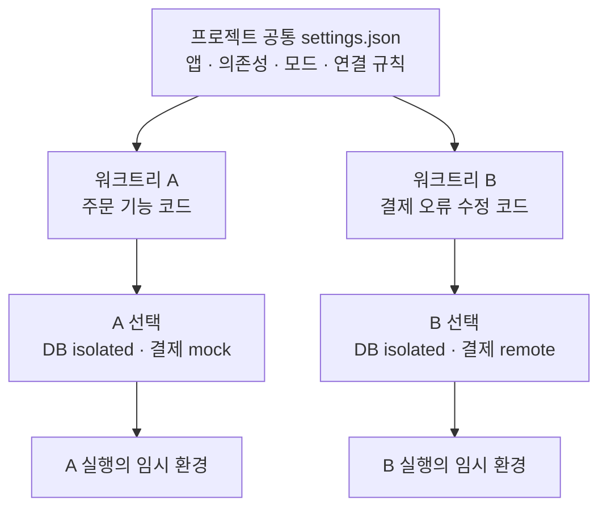
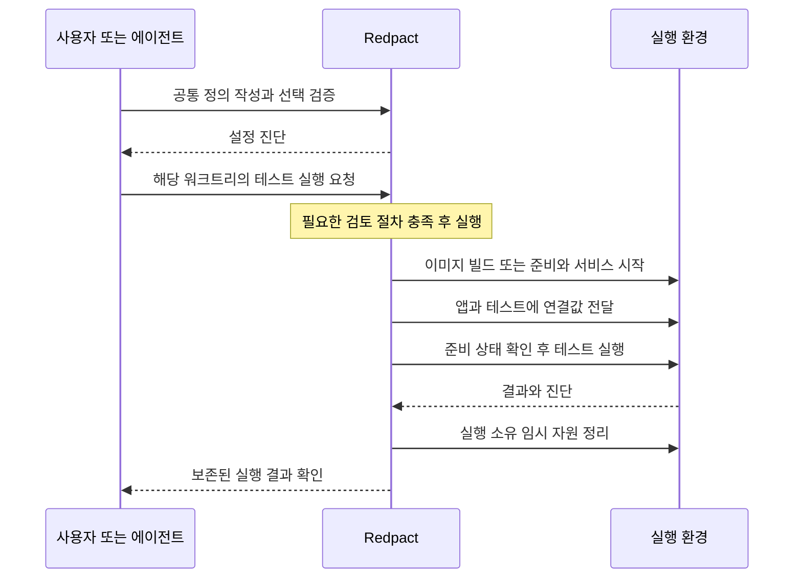

# 의존성과 워크트리

주문 기능을 개발하는 앱이 PostgreSQL과 결제 API를 사용한다고 가정해 보겠습니다. 코드만 체크아웃해서는 해당 기능을 실행할 수 없습니다. DB를 어떻게 준비할지, 결제 API를 실제로 호출할지 대체 구현을 사용할지, 앱에 어떤 연결값을 전달할지 정해야 합니다.

Redpact에서는 이 구성을 프로젝트에 정의하고 작업 워크트리에서 사용할 방식을 선택합니다. 의존성 목록에 항목을 추가하는 일과 서비스를 실제로 시작하는 일은 서로 다른 단계입니다.

## 의존성 목록에는 무엇을 정의하나요?

의존성은 앱이 연동하는 서비스입니다. npm 패키지 같은 코드 라이브러리 설치 목록과 구분하세요. 앱의 패키지 설치와 빌드는 Dockerfile 등 프로젝트의 빌드 정의에서 처리합니다.

| 예시 의존성 | 선택할 수 있는 방식 | 필요한 준비 |
|---|---|---|
| PostgreSQL | `isolated` | Compose 서비스, 준비 상태 확인, 연결값 바인딩 |
| 결제 API | `mock` | 프로젝트에서 실제로 구현한 대체 동작과 연결 설정 |
| 로컬 공용 DB 또는 API | `shared-local` | 접근 가능한 로컬 주소와 공용 테스트 데이터 |
| 원격 DB 또는 API | `remote` | 접근 가능한 주소, 필요한 인증과 테스트 데이터 |

모드는 `isolated`, `shared-local`, `remote`, `mock` 중 프로젝트가 지원하는 것만 선언합니다. 이름만 추가해도 DB나 mock이 설치되는 것은 아닙니다. 같은 컴퓨터에서 별도로 실행 중인 서비스에는 `shared-local`, Cloud나 원격 서버에는 `remote`를 사용합니다. 두 모드 모두 의존 서비스를 생성하거나 정리하지 않습니다.

## 프로젝트는 정의를 공유하고 워크트리는 선택합니다

공통 정의는 기본 체크아웃의 `.redpact/settings.json`에 둡니다. 실제 위치는 `configure`가 반환하는 `rulesRoot`로 확인합니다. 각 체크아웃의 `.redpact/selection.json`에는 사용할 루트 서비스와 의존성 모드를 저장할 수 있습니다.

이는 설정 관계의 예시이며 각 모드가 프로젝트에 구현되어 있어야 합니다. 실행에 명시적으로 전달한 선택이 저장된 선택보다 우선합니다. 선택을 저장하는 것만으로 실행 환경이 시작되지는 않습니다.

| 항목 | 어디에 속하나요? |
|---|---|
| 사용할 수 있는 의존성과 모드 정의 | 프로젝트 공통 설정 |
| 이번 작업에서 고른 모드 | 워크트리의 저장된 선택 또는 명시적인 실행 입력 |
| Compose, Dockerfile, 앱 코드, 테스트 파일 | 실제 실행하는 체크아웃 |
| 실행 중 생성한 관리형 자원 | 해당 실행 |
| 테스트 결과와 기록된 소스 | 보존된 실행 기록 |

공통 설정에 `compose.yaml`을 선언했다면 기능 작업은 해당 기능 체크아웃의 파일을 사용합니다. 기본 체크아웃에서 동작해도 기능 워크트리에 필요한 파일이 없다면 실행이 실패할 수 있습니다.

## 실제 설치와 연결은 언제 일어나나요?

이 흐름은 관리형 통합 실행의 개요입니다. 준비 과정에서 필요한 이미지와 패키지를 확보하며, 이미 준비된 빌드 캐시는 재사용될 수 있습니다. 설정 검증만으로 Docker 접근, 인증, 서비스 준비 상태가 확인되지는 않습니다. 연결값은 설정된 대상의 환경변수로 전달되므로 임의의 포트를 테스트에 고정하지 마세요.

실행마다 임시 자원을 사용하고 종료 후 정리합니다. 별도로 운영하는 외부 서비스는 이 정리 대상이 아니며, 두 워크트리가 같은 외부 DB를 선택했다면 데이터를 공유할 수 있습니다. 테스트 데이터 분리는 외부 서비스 구성에서도 마련해야 합니다.

## 에이전트에게 이렇게 요청하세요

> 이 프로젝트의 앱 실행 방식과 DB·캐시·외부 API 의존성을 조사해줘. 실제로 지원하는 모드를 공통 Redpact 설정에 정의하고, 지금 워크트리에서는 어떤 선택을 사용할지 설명해줘. 각 연결값이 앱과 테스트 어디에 전달되는지도 확인해줘. 설정을 검증한 결과와 아직 실행으로 확인하지 않은 부분을 구분해줘.

먼저 [프로젝트 연결과 설정](first-project.md)을 따라 정의를 작성하세요. 정확한 필드는 [설정 레퍼런스](configuration.md), 설정 후의 사용 과정은 [첫 변경 검토하기](review-workflow.md)로 이어집니다.
