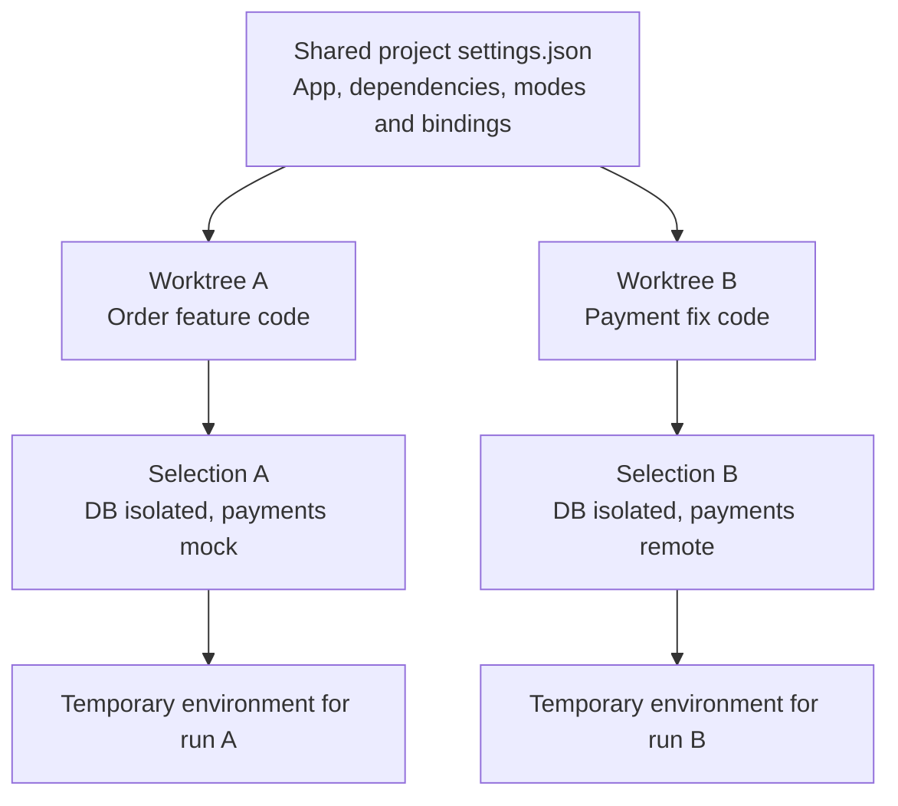
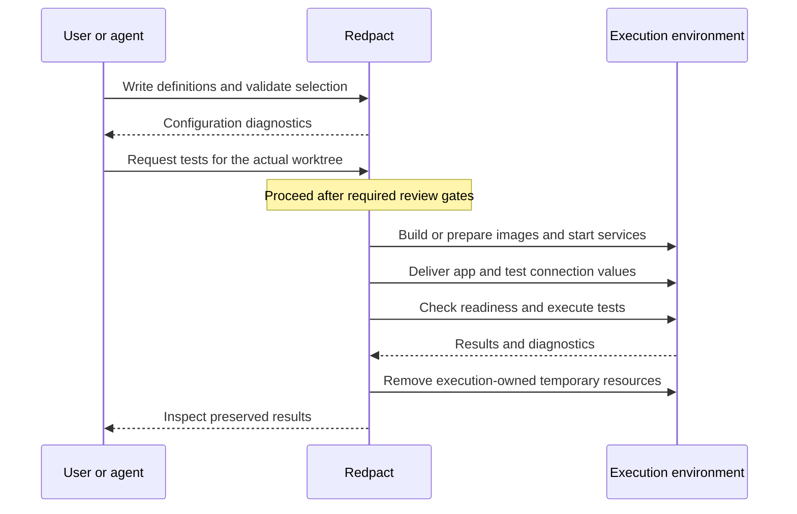

# Dependencies and worktrees

Imagine an order application using PostgreSQL and a payments API. Checking out its code is only part of running it. You also need to decide how to provide the database, whether to call the payment provider or a substitute, and which connection values to deliver to the app.

Redpact stores these options in the project and lets a worktree select an execution configuration. Adding a dependency definition and starting its service are separate steps.

## What belongs in the dependency list?

Dependencies here are services the app integrates with. Code libraries such as npm packages are installed through the project's build definitions, including Dockerfiles.

| Example dependency | Available approach | Required preparation |
|---|---|---|
| PostgreSQL | `isolated` | Compose service, readiness check and connection bindings |
| Payments API | `mock` | An implemented substitute and its connection configuration |
| Local shared database or API | `shared-local` | Reachable local address and shared test data |
| Remote database or API | `remote` | Reachable address, authentication and test data |

Declare only the `isolated`, `shared-local`, `remote`, and `mock` modes your project supports. A mode name does not install a database or implement a mock. Use `shared-local` for an existing service on the local machine; use `remote` for Cloud or independently hosted remote servers. Neither mode starts or cleans up the dependency.

## Projects share definitions; worktrees select options

The primary checkout holds shared `.redpact/settings.json`. Confirm its location through `rulesRoot` returned by `configure`. Each checkout can save root service and dependency choices in `.redpact/selection.json`.

This example illustrates configuration relationships; each selected mode must exist in the project. Explicit execution input takes precedence over saved selection. Saving a selection does not start an environment.

| Item | Owner or location |
|---|---|
| Available dependency and mode definitions | Shared project settings |
| Modes chosen for the task | Saved worktree selection or explicit execution input |
| Compose, Dockerfile, app and test sources | Executing checkout |
| Managed resources created during execution | That execution |
| Results and recorded source | Preserved execution history |

A shared declaration of `compose.yaml` resolves to the feature checkout's file during feature work. Working in the primary checkout does not establish that the necessary files exist in a feature worktree.

## When do installation and connection happen?

This is an overview of managed integration execution. Preparation obtains required images and packages; existing build caches may be reused. Validation alone does not check Docker access, credentials, or service readiness. Configured target environment variables deliver connection values, so avoid hardcoded allocated ports in tests.

Each execution uses temporary resources and removes them at termination. Separately operated external services are outside that cleanup. Two worktrees selecting the same external database can share data; arrange test data isolation in that service as well.

## Ask your agent

> Investigate this project's startup process and database, cache, and external API dependencies. Define implemented modes in shared Redpact settings and explain the selection for this worktree. Check where each connection value reaches the app and tests. Separate configuration validation results from anything that still requires execution.

Follow [Project setup](first-project.md) to write the definitions. See [Configuration](configuration.md) for exact fields and [Review your first change](review-workflow.md) for the workflow after setup.
