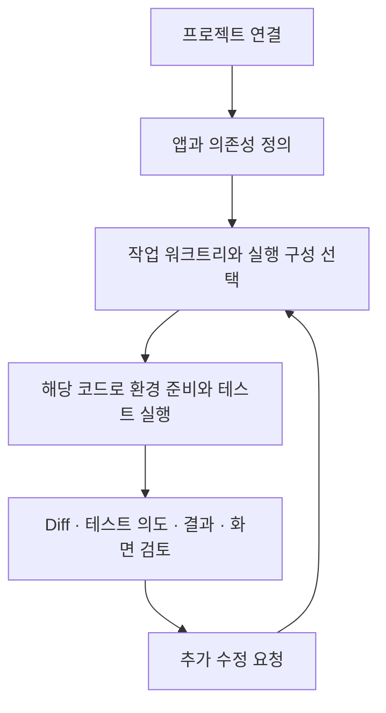

# Redpact로 변경 검토하기

Redpact는 에이전트가 만든 변경을 사람이 검토하는 로컬 개발 도구입니다. 프로젝트에 필요한 실행 환경을 정의하고, 작업 중인 워크트리의 코드로 테스트를 실행한 뒤, 변경사항·검증 의도·실행 결과·애플리케이션 화면을 연결해서 확인합니다.

“완료했습니다”라는 보고를 받았을 때 무엇이 바뀌었는지, 요청한 동작을 실제로 확인했는지, 화면은 어떤 상태인지 직접 판단할 수 있어야 합니다. 이것이 이 가이드가 따라갈 과정입니다.

## 프로젝트 구성부터 변경 검토까지

에이전트는 저장소를 조사하고 설정·코드·테스트를 작성합니다. Redpact는 선택한 실행을 수행하고 근거를 기록합니다. 사용자는 그 근거가 요구사항을 충분히 확인하는지 판단합니다.

## 먼저 이해할 두 가지

**어떤 환경에서 실행했나요?** 앱이 사용하는 DB, 캐시, 외부 API를 공통 설정에 정의합니다. 워크트리는 사용할 의존성 모드를 선택하며 실행은 해당 체크아웃의 파일을 사용합니다. 설정을 공유해도 실행 자원이나 데이터까지 공유되는 것은 아닙니다. [의존성과 워크트리](dependencies.md)에서 이 관계를 먼저 살펴보세요.

**무엇을 근거로 완료를 판단하나요?** Diff는 코드 변경을, 테스트는 확인하려는 동작과 그 결과를, 캡처는 실행 당시의 화면을 보여줍니다. 각각을 함께 읽는 예시는 [첫 변경 검토하기](review-workflow.md)에 있습니다.

## 검토할 질문과 확인할 근거

| 질문 | 확인할 근거 |
|---|---|
| 요청한 변경이 어느 작업에 들어 있나요? | 실제 워크트리와 Diff |
| 어떤 의존성 구성으로 실행했나요? | 선택한 서비스와 의존성 모드, 해당 실행의 환경 정보 |
| 정상 동작과 오류 상황을 모두 확인했나요? | 테스트 소스, 케이스 의도와 단언 |
| 실제로 어디까지 실행됐나요? | 기록된 케이스·단계 결과와 진단 |
| 사용자가 보는 화면은 어떤가요? | 실제 애플리케이션에서 만든 상태별 캡처 |
| 수정한 내용을 다시 실행했나요? | 새 실행의 식별자와 기록된 소스 |

테스트 통과는 작성된 단언이 충족됐다는 뜻입니다. 화면의 적절성이나 빠진 요구사항까지 자동으로 판단하지는 않습니다. 현재 파일은 실행 이후 바뀔 수 있으므로 결과를 읽을 때는 실행 당시의 소스를 확인하세요.

## 내 프로젝트에서 시작하기

1. [설치와 연결](installation.md)에서 로컬 서버와 에이전트를 연결합니다.
2. [프로젝트 연결과 설정](first-project.md)에서 실제 저장소를 조사하고 공통 정의를 작성합니다.
3. [첫 테스트 실행](first-run.md)으로 실행 기록을 만들어 봅니다.
4. [결과 읽기](results.md)와 [검증 작성 가이드](tests.md)를 참고해 자신의 변경에 필요한 근거를 보완합니다.

Redpact는 정식 출시 전입니다. 이 사이트는 현재 로컬 구현의 사용법을 설명합니다. 문서 사이트 자체는 사용자의 프로젝트에 연결되지 않습니다.
