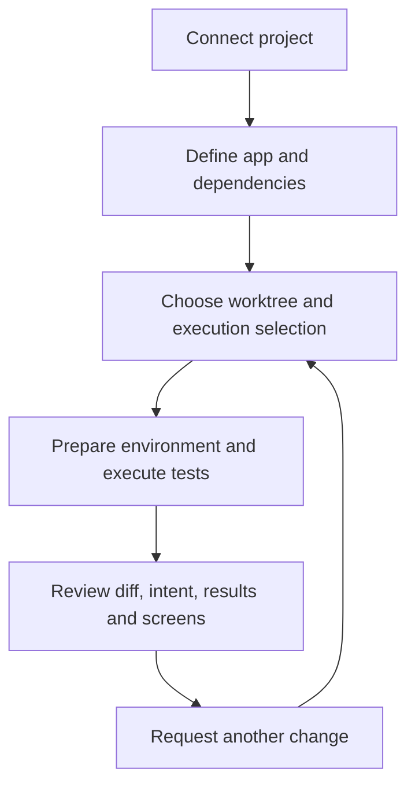

# Review changes with Redpact

Redpact is a local development review tool for people working with coding agents. Define the project's runtime needs, run tests against the working checkout, and inspect code changes, test intent, observed results, and application screenshots together.

When an agent reports completion, you should be able to see what changed, whether the requested behavior was checked, and what the application looked like. This guide follows that process.

## From project setup to change review

The agent investigates the repository and writes configuration, code, and tests. Redpact performs the selected execution and records evidence. You judge whether that evidence adequately covers the request.

## Two questions to understand first

**Which environment ran the code?** Shared settings define the app's database, cache, and external API options. Each worktree can select dependency modes; execution uses that checkout's files. Shared configuration does not imply shared runtime resources or data. Start with [Dependencies and worktrees](dependencies.md).

**What supports the completion claim?** A diff shows code changes, tests show intended checks and their results, and captures show application states during execution. [Review your first change](review-workflow.md) connects these in one example.

## Questions and evidence

| Question | Evidence to inspect |
|---|---|
| Which checkout contains the requested change? | Actual worktree and diff |
| Which dependencies were used? | Selected services and dependency modes, recorded environment information |
| Were success and error behavior checked? | Test source, case intent and assertions |
| How far did execution actually get? | Recorded case and step results, diagnostics |
| What did the user see? | State-specific captures from the actual application |
| Was the revised code executed again? | New execution identity and recorded source |

Passing tests establish that their assertions were satisfied. They do not automatically judge presentation or discover missing requirements. Current files can change after execution; read the recorded source when interpreting results.

## Start with your project

1. [Install and connect](installation.md) the local server and agent.
2. [Connect and configure your project](first-project.md) using the actual repository.
3. [Run your first test](first-run.md) to create execution evidence.
4. Use [Reading results](results.md) and [Writing verification](tests.md) to cover your own change.

Redpact is pre-release. This site describes the current local implementation. The documentation site itself does not connect to your projects.
