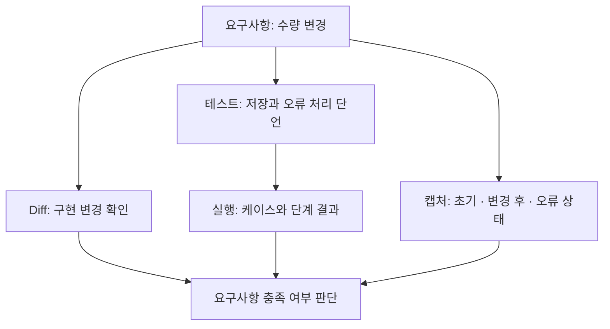
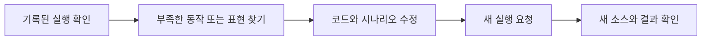

# 첫 변경 검토하기

이 페이지는 “주문 수량을 바꾸면 합계가 갱신되고, 잘못된 수량은 거부된다”는 기능을 예시로 사용합니다. 아래 시나리오와 화면 상태는 자신의 앱에 맞게 작성할 검토 계획이며, 이미 실행된 결과를 뜻하지 않습니다.

[설치](installation.md)와 [프로젝트 설정](first-project.md)을 마친 뒤 작업 중인 실제 체크아웃을 사용하세요.

## 1. 확인할 동작을 먼저 정하기

에이전트에게 코드 변경과 함께 어떤 근거를 남길지 요청합니다.

> Redpact로 주문 수량 변경을 검증해줘. 정상 수량은 합계에 반영되고 잘못된 수량은 기존 주문을 바꾸지 않아야 해. 이 워크트리의 실행 구성과 테스트 의도를 설명하고, 실제 API 검증 결과를 남겨줘. 화면 검토를 위해 변경 전·변경 후·입력 오류 상태도 실제 앱에서 캡처해줘.

| 요구사항 | 확인할 근거 |
|---|---|
| 정상 수량 저장 | 변경 요청 후 다시 읽은 수량과 합계 |
| 잘못된 수량 거부 | 오류 응답과 기존 값 유지 |
| 사용자에게 결과 표시 | 변경 후 합계와 오류 상태의 캡처 |

## 2. 워크트리와 고정 실행 설정 확인하기

어떤 체크아웃을 실행할지 먼저 확인합니다. DB를 실행별로 준비하는지, 결제를 mock으로 처리하는지, 외부 서비스를 사용하는지 살펴보세요. 외부 서비스에 연결했다면 해당 데이터가 다른 작업과 공유되는지도 확인합니다.

프로젝트 공통 정의와 체크아웃별 실행의 관계는 [의존성과 워크트리](dependencies.md)를 참고하세요. 프로젝트 **Tests**는 기본 체크아웃을 대상으로 합니다. 기능 작업의 근거는 해당 워크트리의 검토 화면과 실행 기록에서 확인해야 합니다.

## 3. 코드 변경과 검증 의도 읽기

Diff에서 주문 처리 코드가 어떻게 달라졌는지 살펴봅니다. 테스트에서는 제목뿐 아니라 실제 단언을 읽으세요. “합계가 갱신된다”는 제목인데 상태 코드만 확인하면 요구사항을 충분히 검증하지 못합니다.

통합 테스트의 요청 당시 소스와 실행 결과를 연결해서 확인하세요. 검토 대기 중 파일을 고쳐도 이미 수집된 제출 소스는 바뀌지 않습니다.

## 4. 결과와 실제 화면 함께 보기

API 테스트로 저장 동작을 확인하고, 브라우저 기능 테스트로 사용자 조작을 확인하며, 캡처로 화면을 살펴봅니다. 이들은 서로 다른 질문에 답합니다. 테스트가 통과해도 오류 메시지가 불명확하면 추가 수정을 요청할 수 있습니다.

워크트리 Playwright는 작업 전용 초안과 변경된 유지 시나리오 파일에 관련된 근거를 보여줍니다. 이는 소스 파일 기준이며 화면 픽셀 변경이나 앱 코드의 영향 범위를 자동 판정하는 기능이 아닙니다. 상세 동작은 [결과 읽기](results.md)를 참고하세요.

## 5. 부족한 점을 수정하고 새 실행 확인하기

실패한 단언은 원인과 함께 읽으세요. 환경 준비 실패라면 먼저 실행 구성을 고쳐야 합니다. 예상과 다른 앱 결과라면 의도한 요구사항을 유지하면서 구현 또는 잘못 설계한 테스트를 수정합니다.

이전 통과 기록을 수정된 코드의 결과로 사용하지 마세요. 새 실행의 체크아웃, 기록된 소스와 결과를 확인한 뒤 작업을 판단합니다. 실행 자원을 정리해도 기록된 근거는 남습니다.

다음은 [결과와 화면 읽기](results.md)입니다. 검증을 작성하는 세부 방법은 [검증 작성 가이드](tests.md)에 모았습니다.
