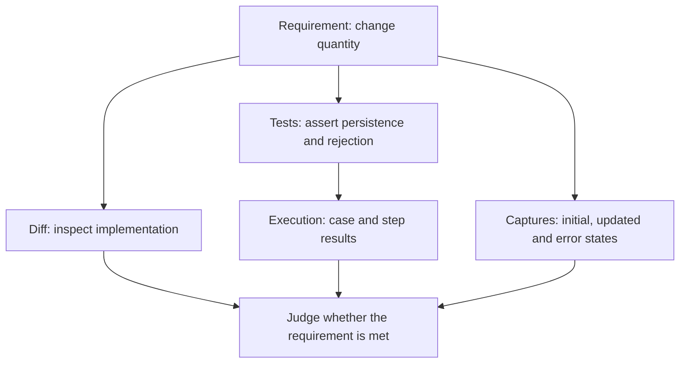
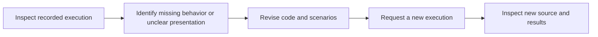

# Review your first change

This walkthrough uses an order quantity feature: changing quantity updates the total, while invalid quantity is rejected. The scenarios and screen states below are a review plan to implement in your own app, not previously observed results.

Complete [Installation](installation.md) and [Project setup](first-project.md), then use the actual working checkout.

## 1. Define the behavior to check

Ask the agent to produce evidence alongside the implementation.

> Use Redpact to verify order quantity changes. Valid quantities must update the total; invalid quantities must leave the existing order unchanged. Explain the fixed project execution configuration and test intent, and record actual API results. Also capture the initial, updated, and input-error states from the real app for screen review.

| Requirement | Evidence |
|---|---|
| Save a valid quantity | Read back quantity and total after the update |
| Reject invalid quantity | Error response and unchanged stored values |
| Show the result to users | Updated total and error-state captures |

## 2. Check the worktree and fixed execution configuration

Confirm the checkout to execute. Inspect whether the database is prepared per execution, payments use a mock, or an external service is selected. With external services, check whether their data is shared with other work.

See [Dependencies and worktrees](dependencies.md) for shared definitions and checkout-specific execution. Project **Tests** targets the primary checkout. Inspect feature-work evidence through that worktree's review surfaces and execution history.

## 3. Read code changes and test intent

Inspect how order handling changed in the diff. Read the assertions as well as test titles. A test titled “updates the total” that only checks a response status does not establish that requirement.

Connect the integration source captured at request acceptance to the execution result. Editing files during review does not change the already captured submission.

## 4. Inspect results and actual screens together

API tests check persistence, browser functional tests check user interactions, and captures support screen review. They answer different questions. Passing tests can still leave an unclear error message worth revising.

Worktree Playwright shows evidence associated with worktree drafts and changed maintained scenario files. This is source-file scope, not automatic pixel comparison or app-code impact analysis. See [Reading results](results.md).

## 5. Revise and inspect a new execution

Read failing assertions with their cause. Environment preparation failures require configuration or runtime fixes first. Unexpected application behavior calls for revising implementation or an incorrectly designed test while preserving the intended requirement.

Do not apply an earlier passing result to revised code. Check the new execution's checkout, recorded source and results before judging the work. Resource cleanup preserves recorded evidence.

Continue with [Reading results and screens](results.md). Authoring details live in [Writing verification](tests.md).
